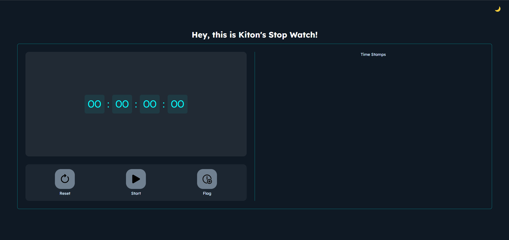

# Kiton's Stop Watch ⏱️

A stylish, fully functional stopwatch web application that allows users to start, pause, reset the timer, and capture timestamps. The stopwatch also includes a light and dark theme toggle for a customizable experience.

## 🚀 Live Demo

Check out the live version of the stopwatch [here](https://kirtanpatel01.github.io/ARKA_WD_2/).

## 📂 Project Overview

**Kiton's Stop Watch** is a simple yet elegant stopwatch built using modern web technologies. It is designed to be user-friendly with basic stopwatch functionalities like start, stop, reset, and timestamp recording. It also includes a light/dark mode theme switcher for better visual customization.

### Features

- **Start/Pause Functionality**: Click the button to toggle between starting and pausing the stopwatch.
- **Reset Button**: Reset the stopwatch and clear all the logged timestamps.
- **Timestamp Logging**: Capture and display the current time on the stopwatch as a timestamp.
- **Theme Toggle**: Switch between light and dark modes for better user experience.
- **Responsive Design**: Adaptable layout for all screen sizes, ensuring usability across various devices.

## 🛠️ Technologies Used

- **HTML5**: For page structure and layout.
- **CSS3**: For design and responsive layout.
- **JavaScript**: To handle the stopwatch logic and interactivity.
- **Google Fonts**: Custom typography using DM Sans and Lexend fonts.

## 📦 Installation

To run this project locally, follow these steps:

1. Clone the repository:

    ```bash
    git clone https://github.com/kirtanpatel01/ARKA_WD_2.git
    ```

2. Navigate to the project folder:

    ```bash
    cd ARKA_WD_2
    ```

3. Open `index.html` in your browser to view the stopwatch.

## 💡 Usage

1. **Start/Pause**: Click on the "Start" button to begin the stopwatch. The button changes to "Pause" while running. Click again to pause.
2. **Reset**: Press the "Reset" button to set the timer back to `00:00:00:00` and clear all timestamps.
3. **Capture Timestamps**: Use the "Flag" button to log the current time from the stopwatch in the timestamp section.
4. **Toggle Theme**: Switch between light and dark modes by clicking the 🌙 or ☀️ icon at the top right.

## 📸 Screenshots



## 🔧 Development

Feel free to contribute! Fork this repository, make your changes, and submit a pull request.

## 🤝 Contributing

1. Fork the repository.
2. Create a new feature branch (`git checkout -b feature/your-feature`).
3. Commit your changes (`git commit -m 'Add new feature'`).
4. Push the branch (`git push origin feature/your-feature`).
5. Open a pull request.
